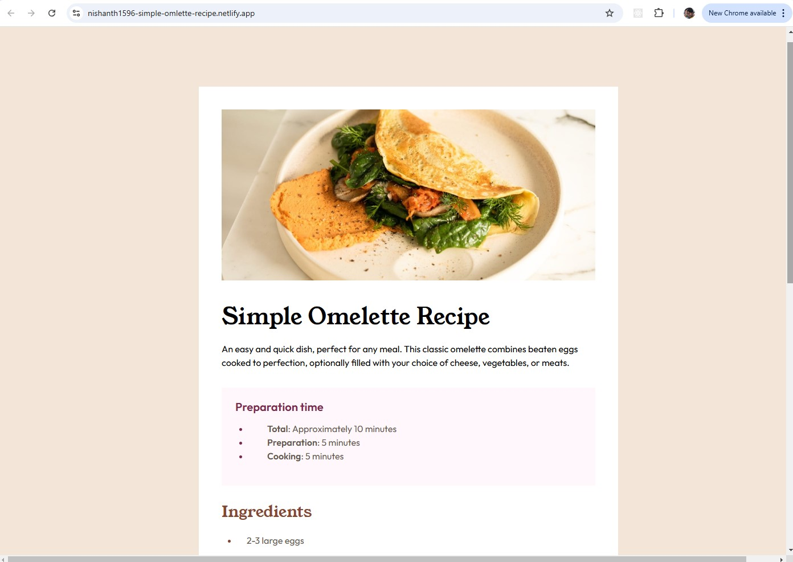

# Frontend Mentor - Recipe Page Solution

This is my solution to the [Recipe page challenge on Frontend Mentor](https://www.frontendmentor.io/challenges/recipe-page-KiTsR8QQKm). The challenge allowed me to focus on building a recipe page layout that is designed **specifically for desktop**. The goal was to structure and style a recipe page using HTML and CSS, with a strong focus on a **desktop-first** approach.

## Table of Contents

- [Overview](#overview)
  - [The Challenge](#the-challenge)
  - [Screenshot](#screenshot)
  - [Links](#links)
- [My Process](#my-process)
  - [Built With](#built-with)
  - [What I Learned](#what-i-learned)
  - [Continued Development](#continued-development)
  - [Useful Resources](#useful-resources)
- [Author](#author)
- [Acknowledgments](#acknowledgments)

---

## Overview

### Screenshot

### Links

- Solution URL: [GitHub Repository](https://github.com/nishanth1596/Simple-omlette-recipe)
- Live Site URL: [Live Site Link](https://nishanth1596-simple-omlette-recipe.netlify.app/)

---

## My Process

### Built With

- **HTML5**: Used semantic elements to structure the page.
- **CSS3**: Styled the page with a focus on desktop design.
- **Custom Properties**: Implemented custom properties for colors and fonts.
- **Flexbox**: Used Flexbox to create a flexible layout.
- **Desktop-First Design**: The layout and styling were designed primarily for larger screens.

### What I Learned

- **Flexbox**: Deepened my understanding of using Flexbox to create responsive layouts. Even though the page is desktop-first, Flexbox helped create a more flexible and modern layout.
- **CSS Layout Techniques**: Worked with different CSS properties like margin, padding, and alignment to achieve a neat and well-spaced design.
- **Semantic HTML**: Used semantic elements such as `<header>`, `<section>`, `<figure>`, and `<table>` to ensure clear structure and accessibility.

### Continued Development

- **Optimizing for Mobile**: While the page was designed for desktop, I plan to experiment with adding basic media queries for mobile responsiveness in the future.
- **Improving Accessibility**: The next step will be to improve accessibility by adding ARIA labels and enhancing the navigation for screen readers.
- **Adding JavaScript Interactivity**: I would also like to add some JavaScript functionality, such as a cooking timer or user-generated recipe submission forms.

### Useful Resources

- [MDN Web Docs - Flexbox](https://developer.mozilla.org/en-US/docs/Web/CSS/CSS_Flexible_Box_Layout/Using_CSS_flexible_boxes) – Great documentation for understanding Flexbox layouts.
- [Frontend Mentor - Recipe Page Challenge](https://www.frontendmentor.io/challenges/recipe-page-KiTsR8QQKm) – A helpful challenge page and community.
- [CSS Tricks - Flexbox](https://css-tricks.com/snippets/css/a-guide-to-flexbox/) – A comprehensive guide to Flexbox by CSS Tricks.

---

### Continued development

I want to continue improving my understanding of layout techniques like Flexbox and CSS Grid to create more complex and responsive designs.

### Author

- Name: Nishanth
- Website - [My GitHub Profile](https://github.com/nishanth1596)
- Frontend Mentor - [@nishanth1596](https://www.frontendmentor.io/profile/nishanth1596)
- Twitter - [@nishanth1596](https://x.com/nishanth1596)

## Acknowledgments

Thanks to Frontend Mentor for providing this great challenge, which gave me the opportunity to practice creating a focused, desktop-first recipe page layout. Also, thanks to the community for the feedback and inspiration!
